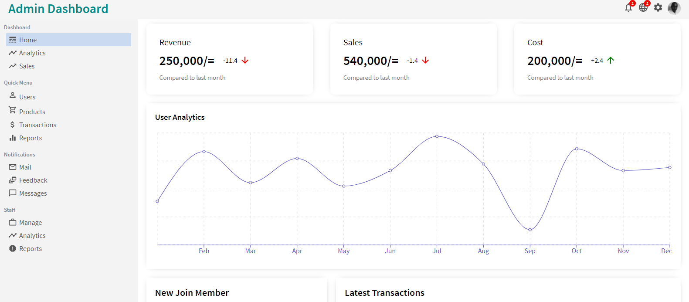
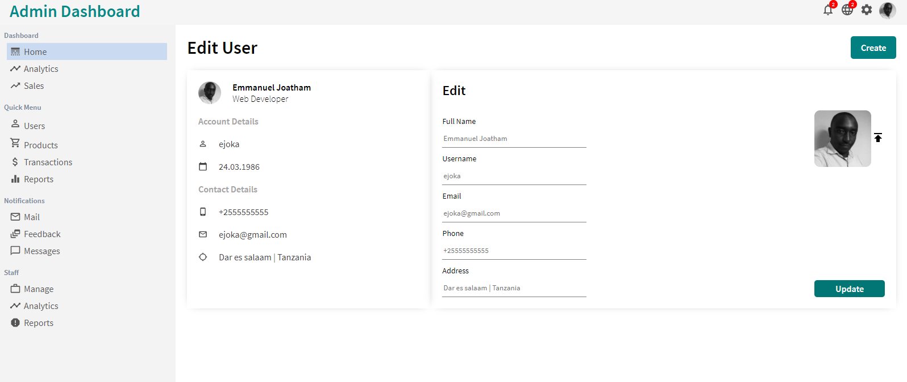
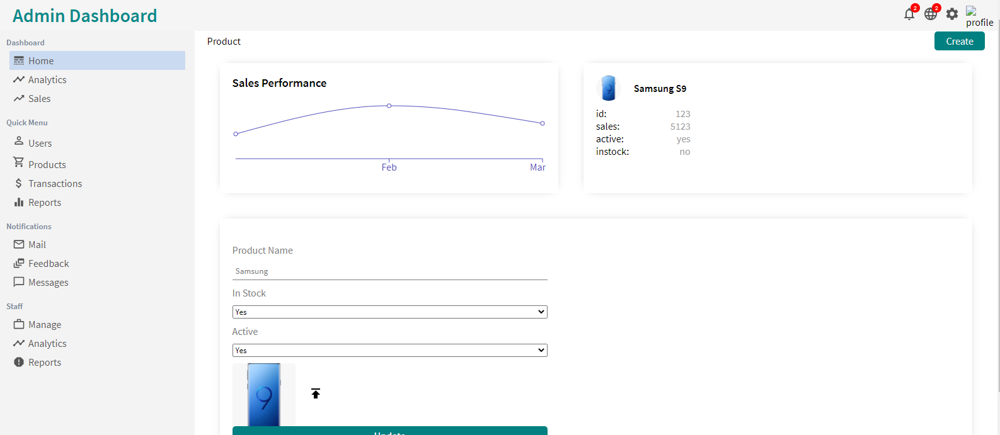

# Admin Dashboard
This is a frontend template for an admin dashboard. It can be connected with a backend and be used as dashboard for creating, adding, updating and deleting resources. I have created two sample resources i.e a User and a Product with their functionalities, but have also added other resources as a sample without their core functionalities. 

# Live Link
<a href="https://ejokadashboard.netlify.app/">Click Here</a>

## Built With

- HTML
- CSS
- ReactJS
- MaterialUI Icons
- ChartJS

## Getting Started

Open your terminal or text editor and use next command

        git clone https://github.com/emmanuelkamala/dashboard.git

        cd dashboard

        # Running the app
        ### run 'yarn install' to install dependencies
        ### yarn start

## Opening the app

Then open the browser and enter this link:
http://localhost:3000

After if you want to do any changes please create new branch, after changes open pull request.
Happy coding! 

## Authors

👤 **Author1**

- Github: [emmanuelkamala](https://github.com/emmanuelkamala)
- Twitter: [ejkamala](https://twitter.com/ejkamala)
- Linkedin: [emmanuelkamala](https://linkedin.com/in/emmanuelkamala)

## 🤝 Contributing

Contributions, issues and feature requests are welcome!

Feel free to check the [issues page](issues/).

## Show your support

Give a ⭐️ if you like this project!

## 📝 License

This project is [MIT](lic.url) licensed.
